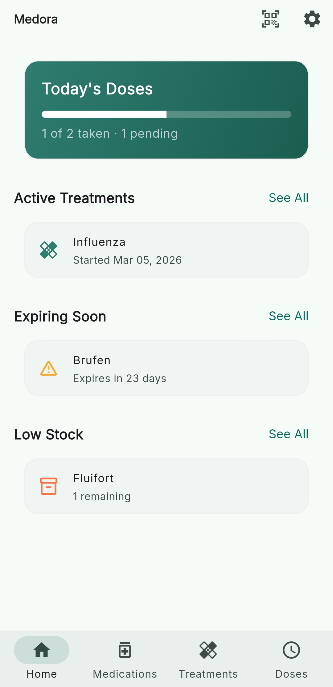
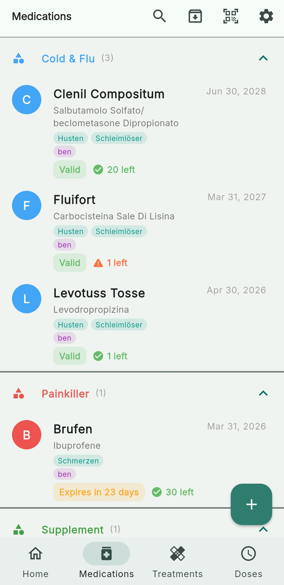
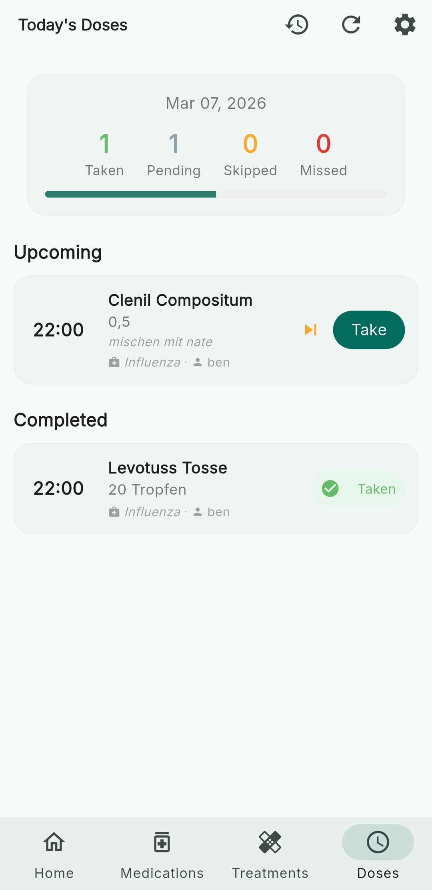

#  Medora — Home Medicine Cabinet Manager

A production-ready Flutter mobile application for managing your home medicine cabinet, tracking medication expiration dates, creating treatment plans, managing dose schedules, and receiving medication reminders.

<p align="center">
  
  
  
</p>

## Features

- **Medication Inventory** — Add, edit, delete, and view medications with full details (name, active ingredient, category, quantity, expiry date, barcode, storage location, notes).
- **Expiry & Stock Alerts** — Automatically detects medications expiring within 30 days and medications with low stock.
- **Barcode Scanner** — Scan medication package barcodes using the device camera (`mobile_scanner`). Barcodes are stored with each medication.
- **Treatment / Illness Tracking** — Create treatment plans with symptoms, start/end dates, and notes.
- **Prescription Plans** — Attach medication prescriptions to treatments with dosage, interval, and duration.
- **Dose Scheduling** — Auto-generated dose log entries with pending/taken/skipped/missed status.
- **Reminders** — Local push notifications for each scheduled dose (`flutter_local_notifications`).
- **Dashboard** — Home screen with summary cards: today's doses, expiring meds, low stock, active treatments.
- **Settings** — Notification controls, sync status, and future feature placeholders.

---

## Prerequisites

- **FVM** — Flutter Version Manager ([install guide](https://fvm.app/documentation/getting-started/installation))
- **Flutter 3.41+ (stable)** — managed via FVM
- **Supabase account** — [supabase.com](https://supabase.com)
- **Android Studio / Xcode** — for device emulators

---

## Setup Instructions

### 1. Clone and install Flutter via FVM

```bash
cd medora
fvm install        # installs the pinned Flutter version
fvm use stable     # already configured
```

### 2. Configure Supabase

1. Create a new Supabase project at [supabase.com](https://supabase.com).

2. **Run the SQL schema** — go to your Supabase dashboard → **SQL Editor** → **New Query**, paste the contents of `supabase/migrations/001_initial_schema.sql` and click **Run**.

3. **Run the RLS policies** — open a second **New Query**, paste `supabase/migrations/002_rls_policies.sql` and click **Run**.

   > **Important:** The MVP uses permissive RLS (`USING (true)`) so no authentication is required. All four tables (`medications`, `treatments`, `prescriptions`, `dose_logs`) must exist before running the app.

4. Copy `.env.example` to `.env` and fill in your credentials from the Supabase dashboard → **Project Settings → API**:
   ```bash
   cp .env.example .env
   ```
   ```
   SUPABASE_URL=https://your-project.supabase.co
   SUPABASE_ANON_KEY=your-anon-key-here
   ```

### 3. Install dependencies

```bash
fvm flutter pub get
```

### 4. Run the app

```bash
# Android
fvm flutter build apk --debug

# Android Emulator
fvm flutter run

# iOS (macOS only)
fvm flutter run --device-id=<ios-device-or-simulator>

# Web
fvm flutter build web --release

# Linux
fvm flutter build linux --release
```

> **Note:** The project requires **minSdk 28** (Android 9.0+) due to `mobile_scanner` and `supabase_flutter`. Core library desugaring is already configured in `android/app/build.gradle.kts` for `flutter_local_notifications`.

### 5. (Optional) Run code generation

If you add Freezed/json_serializable models:

```bash
fvm dart run build_runner build --delete-conflicting-outputs
```

---
