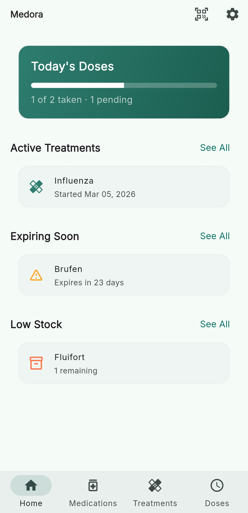
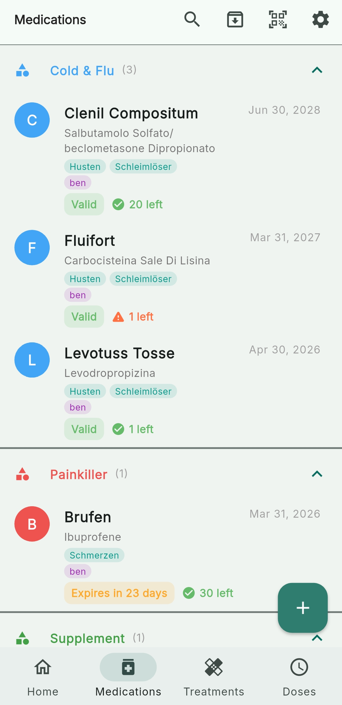
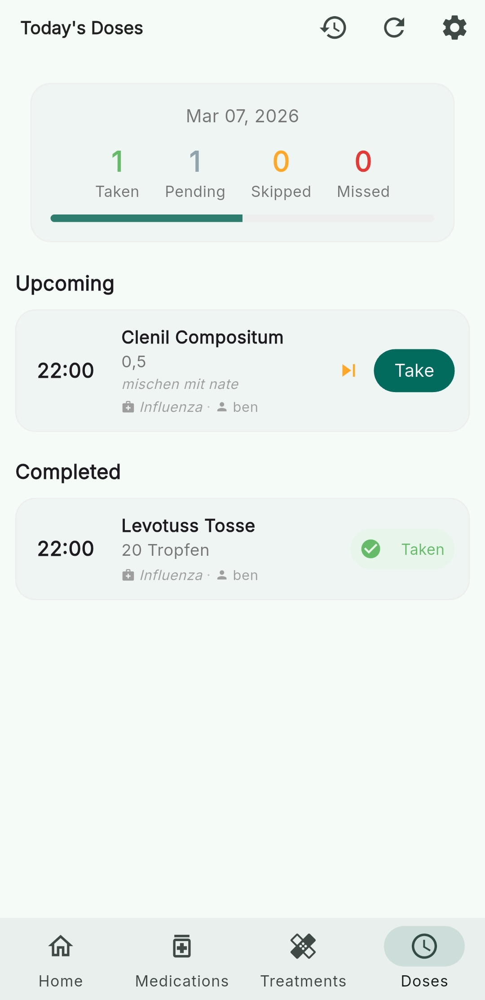

#  Medora — Home Medicine Cabinet Manager

A Flutter app for the medicine cabinet at home: what you own, what expires
when, which treatment it belongs to, and when the next dose is due. It works
completely offline — no account, no network — and can optionally sync across
devices through Supabase.

<p align="center">
  
  
  
</p>

## Features

- **Medication inventory** — name, active ingredient, category, quantity, expiry date, barcode, storage location, photo and notes.
- **Expiry & stock alerts** — flags medications expiring within 30 days and anything at or below the low-stock threshold.
- **AIC code scanner** — point the camera at an Italian package; on-device OCR (ML Kit) reads the AIC code and looks it up in the AIFA database, cached locally after a one-time download.
- **Treatments** — illness/treatment plans with symptoms, start and end dates, and notes.
- **Prescriptions** — attach a medication to a treatment with dosage, interval and duration.
- **Dose schedule** — auto-generated dose entries with pending / taken / skipped / missed status; stale pending doses become "missed" after a configurable grace period.
- **Reminders** — local notifications for upcoming doses.
- **Dashboard** — today's doses, expiring medications, low stock, active treatments.
- **Export** — CSV and PDF of medications, treatments and dose history.
- **Family sharing** — optional, on top of cloud sync: join a family by invite code and share the cabinet.
- **English, German and Italian**, light and dark themes, biometric lock.

## Platforms

| Platform | Status |
|---|---|
| Android (`minSdk 28`) | Full functionality. |
| iOS | Full functionality. |
| Web | Installable PWA; no OCR scanning, photo capture or scheduled notifications. |
| Linux / Windows | Full local functionality; the desktop plugins cannot schedule notifications. |

## Quick start

Medora needs Flutter 3.44.6 / Dart 3.12 or newer (it uses private named
parameters), which is why every command below goes through `fvm`.

```bash
fvm install                 # Flutter is pinned in .fvmrc (see https://fvm.app)
fvm flutter pub get
fvm flutter run             # pick a device: Android, iOS, Linux, Windows, Chrome
```

That is the whole setup. Medora runs local-only by default: everything lives in
a SQLite database on the device, nothing is uploaded, and no configuration file
is needed.

## Optional: cloud sync with Supabase

1. Apply the SQL files in `supabase/migrations/` in order. With the [Supabase CLI](https://supabase.com/docs/guides/cli):
   - **Fresh project** (nothing applied yet): `supabase db push` applies both migrations.
   - **Existing install** that ran `20260901000000_initial_schema.sql` by hand: the migration history is empty, so `supabase db push` would try to replay the initial schema. Tell Supabase it is already applied first, then push:

     ```bash
     supabase migration repair --status applied 20260901000000
     supabase db push
     ```

   - Or skip the CLI entirely and paste only the new file (`20260914000000_tombstones_and_family.sql`) into the SQL editor. It is written to be re-runnable (`IF NOT EXISTS`, `CREATE OR REPLACE`, `DROP POLICY IF EXISTS`).
2. Copy `dart_defines.example.json` to `dart_defines.json` and fill in your project URL and anon/publishable key.
3. Run or build with the defines:

```bash
fvm flutter run --dart-define-from-file=dart_defines.json
fvm flutter build apk --release --dart-define-from-file=dart_defines.json
```

Then open **Settings → Cloud sync → Turn on** and sign in. Without defines the app runs local-only and the cloud section says so.

### How sync works

- Offline-first: every change is written to the local database first and works with no network.
- Each cycle pushes the pending local changes, then pulls only what changed since the last pull (delta by `updated_at`).
- Deletes are tombstones (`deleted_at`), so a deletion made on one device is applied on every other device.
- A row edited on two devices resolves **last write wins by `updated_at`** — the newer edit wins, whichever device syncs last. Before uploading an edited row the push reads the server row's `updated_at` and stands down if the server copy is newer, leaving the row for the pull to overwrite (the report counts these as skipped, not failed); the pull side keeps a local edit that is newer than the server copy. Newly created rows and tombstones upload unconditionally, and a tombstone always wins over a live row.
- Settings shows the last sync report — what was pushed, pulled and deleted, and any rows that failed.
- A row that keeps failing to upload is retried with an exponential backoff (2 minutes, doubling, up to 6 hours) instead of failing every cycle. Tapping the report lists those rows, and **Discard local change** gives up on one: the device accepts the server's copy on the next pull.
- **Force pull** wipes the local rows and re-downloads everything from the server. Local changes that have not been uploaded yet are lost. If a table cannot be fetched after the wipe, the cycle reports an error rather than a partial success.
- Signing in uploads the data already on the device instead of discarding it. If that data was saved under a *different* account, the app asks whether to merge it into the new account or delete it, rather than uploading one person's records into someone else's.

### Integration test

A convergence test drives two simulated devices against a real Supabase. Start one locally and run it with the defines:

```bash
supabase start
fvm flutter test test/integration \
  --dart-define=SUPABASE_URL=http://127.0.0.1:54321 \
  --dart-define=SUPABASE_ANON_KEY=<anon key from `supabase status`>
```

Without those defines the test is skipped, so a plain `fvm flutter test` needs no Supabase. In CI the same test runs in the `integration` job, which is triggered manually (**Run workflow**) or by adding the `integration` label to a pull request.

## Development

```bash
fvm flutter analyze --fatal-infos          # CI gate
fvm dart format --set-exit-if-changed .    # CI gate — always the bundled Dart
fvm flutter test                           # unit, widget and golden tests
fvm flutter gen-l10n                       # after editing lib/l10n/*.arb; commit the generated output
fvm flutter test --update-goldens test/goldens/   # only for a deliberate UI change; review the PNGs
```

Always drive Dart through `fvm` — a standalone `dart` from PATH may format
differently from the pinned SDK and will fail the CI format gate. Every
user-facing string goes into all three ARBs (`app_en`, `app_de`, `app_it`); two
sweep tests fail the build on hardcoded strings and on raw `Colors.*` in the
presentation layer.

### Updates

Android builds distributed from GitHub Releases check once a day for a newer
release and can also be checked on demand from **Settings → About**. See
[`docs/release.md`](docs/release.md#cutting-a-release) for how a release is
cut and named.

## Documentation

- [`docs/architecture.md`](docs/architecture.md) — layers, app modes, the local schema ledger, reminders, sync, theming and the test layout.
- [`docs/release.md`](docs/release.md) — keystore setup, signed Android/iOS/web builds, CI secrets, versioning.
- [`docs/superpowers/specs/`](docs/superpowers/specs/) — design specs; [`docs/superpowers/plans/`](docs/superpowers/plans/) — implementation plans.

## License

Private project. All rights reserved.
